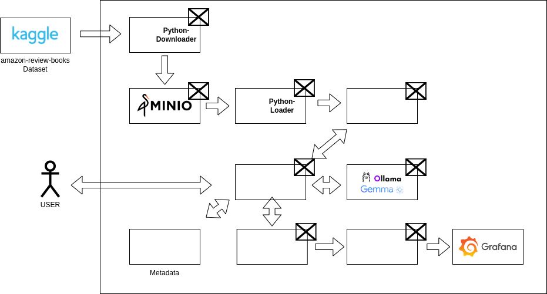

# Book-review-assistant

This repository contains a powerful Book Review Assistant application built using a Large Language Model (LLM). The assistant helps users generate comprehensive book reviews by analyzing key themes, characters, and plots from a provided book summary or input text. 

## 1. Problem Overview

Readers often struggle to select books that match their interests, preferences, or mood. With a vast range of genres, authors, and themes, finding the perfect book can be overwhelming. For example, a reader who enjoys historical fiction might not always know where to find books that mix history with a fast-paced narrative style. Similarly, a fan of science fiction may be looking for books that explore philosophical questions rather than action-driven plots, but identifying these nuances can be difficult.

Additionally, while there are book reviews, recommendations, and summaries available online, readers may not always have the time to sift through this vast information or may find it difficult to trust generic reviews. The need for personalized book recommendations, based on specific criteria such as genre, writing style, and previous reading history, is an ongoing challenge for readers.

For instance, a reader might say, "I loved The Night Circus by Erin Morgenstern for its magical realism and rich, immersive world-building. What other books might give me a similar experience?" In such cases, general recommendation systems may fall short in delivering nuanced suggestions, whereas a tool utilizing an LLM could provide more insightful recommendations. By considering a combination of factors—like writing style, themes of enchantment, or atmospheric storytelling—the LLM could suggest titles like The Starless Sea by the same author or Jonathan Strange & Mr Norrell by Susanna Clarke, with explanations for why each recommendation aligns with the reader's interests.

### 1.1. How LLMs Can Help?

Large Language Models (LLMs), such as GPT-based models, can play a significant role in addressing this problem by providing personalized, human-like recommendations based on user input. Here’s how LLMs offer value:

1. **Natural Language Understanding**: LLMs can interpret user queries expressed in everyday language. A user can simply describe their preferences—such as “I’m in the mood for a mystery novel with deep character development,” or “I loved the pacing in *The Da Vinci Code*, what should I read next?”—and the model can understand and generate appropriate suggestions.

2. **Contextual Recommendations**: Unlike simple recommendation engines that rely on predefined algorithms (e.g., "customers who bought X also bought Y"), LLMs can process vast amounts of textual information from multiple sources, such as book reviews, summaries, and author interviews. They can then offer recommendations that not only match the user’s specific request but also explain why a particular book would be a good fit based on the reader’s preferences.

3. **Summarizing Reviews and Content**: LLMs can process book reviews, synopses, and critical analyses, providing concise summaries for readers who want quick insights into a book without having to go through multiple reviews. This saves time and ensures that users can make informed decisions quickly.

4. **Enhanced Personalization**: LLMs can remember previous interactions (based on integration with a user’s profile) to deliver tailored recommendations over time. For example, if a reader has consistently shown interest in books with philosophical themes or specific authors, the LLM can incorporate this information into future recommendations.

5. **Engagement and Interaction**: LLMs can simulate conversations with users about their reading preferences. This allows for an interactive experience where users can ask follow-up questions, refine their preferences, and explore different genres or authors dynamically. For example, a reader might ask, “Is this book suitable for young adults?” or “How does this author compare to someone like George Orwell?”

## 2. Description of Solution

This architecture aims to address the challenge of personalized book recommendations using a combination of open-source tools and machine learning models. The solution integrates various components that interact to process book review data, store embeddings, and utilize a large language model (LLM) to generate recommendations.

### 2.1. **Solution Architecture: Book Review Assistant**

#### **1. Dataset: Amazon Review Books (Kaggle)**
- **Purpose**: The dataset contains book reviews from Amazon, providing essential data points like ratings, review text, and user information.
- **Source**: The dataset will be downloaded from Kaggle, specifically the *amazon-review-books* dataset, which serves as the foundation for extracting valuable book-related insights.

#### **2. Python Script for Dataset Download**
- **Implementation**: A Python script is used to automate the download of the dataset from Kaggle. This script will authenticate with Kaggle’s API, retrieve the dataset, and prepare it for further processing.
- **Key Components**:
  - Kaggle API integration
  - Data preprocessing (e.g., filtering, removing null values)

#### **3. MinIO for Dataset Storage**
- **Purpose**: MinIO is used as an object storage solution to store the downloaded dataset. This setup allows scalable and efficient storage for large datasets.
- **Workflow**:
  - After the dataset is downloaded via the Python script, it is stored in MinIO buckets for further access.
  - MinIO acts as a highly available and S3-compatible storage backend.

#### **4. Python Script to Load Data into Elasticsearch**
- **Implementation**: A second Python script is created to read the dataset from MinIO and load the data into Elasticsearch. Each book review will be indexed as a document, and an embedding of the review text will be generated for later similarity searches.
- **Components**:
  - Elasticsearch’s Python client for inserting documents
  - Text embeddings generated using a pre-trained model like Sentence-BERT

#### **5. Elasticsearch for Document and Embedding Storage**
- **Purpose**: Elasticsearch will store both the original review text as well as the corresponding vector embeddings of the text. These embeddings will be used to perform similarity searches to find reviews that are contextually relevant to a user query.
- **Workflow**:
  - Review documents are indexed in Elasticsearch.
  - Text embeddings are stored alongside the documents, enabling semantic search functionalities.

#### **6. Flask API for Document Retrieval and Prompt Generation**
- **Purpose**: A Flask API is developed to interface with Elasticsearch and retrieve documents (reviews) that are closest to the user’s input query. The Flask API will also generate prompts for the LLM model to enhance recommendation quality.
- **Workflow**:
  - The API accepts a user query.
  - Retrieves the top relevant documents from Elasticsearch based on embedding similarity.
  - Forms a prompt using the retrieved documents to feed into the LLM.

#### **7. Ollama Container for LLM (Gemma2B Model)**
- **Purpose**: The Ollama container runs the Gemma2B model, an LLM specifically designed to handle text generation tasks. This model processes the prompt generated by the Flask API and outputs personalized book recommendations based on the extracted book reviews.
- **Workflow**:
  - The Flask API sends a formatted prompt to the LLM model running inside the Ollama container.
  - The model generates a response, which is presented as a personalized recommendation to the user.

#### **8. PostgreSQL for Metadata Storage**
- **Purpose**: PostgreSQL is used to store metadata related to user queries, recommendations, and system performance metrics.
- **Stored Data**:
  - User query history
  - LLM responses
  - Elasticsearch query metadata (e.g., search times, relevance scores)

#### **9. RAG (Retrieval-Augmented Generation) Evaluation with Prefect and Grafana**
- **Purpose**: Prefect is used for orchestrating the data pipelines and evaluation tasks, while Grafana monitors the overall system performance, specifically focusing on the quality of the RAG system.
- **Workflow**:
  - Prefect manages workflows such as dataset downloads, Elasticsearch indexing, and recommendation generation.
  - Grafana tracks and visualizes metrics like response times, recommendation quality (using custom evaluation metrics), and LLM accuracy in generating relevant suggestions.

### 2.2. **End-to-End Workflow:**
1. The dataset is downloaded from Kaggle and stored in MinIO.
2. A Python script loads the dataset from MinIO into Elasticsearch, storing both reviews and embeddings.
3. A user interacts with the Flask API, which retrieves the most relevant reviews based on similarity search.
4. The Flask API generates a prompt and sends it to the Gemma2B LLM model in the Ollama container.
5. The LLM generates a book recommendation based on the retrieved reviews.
6. The recommendation and system performance data are stored in PostgreSQL, and Prefect orchestrates workflow evaluations.
7. Grafana monitors the system’s RAG process to ensure optimal performance and recommendation accuracy.

In summary, LLMs help create a personalized, intuitive, and efficient system for book recommendations, enhancing the reader’s experience by providing suggestions that are contextually relevant, insightful, and tailored to individual tastes.
